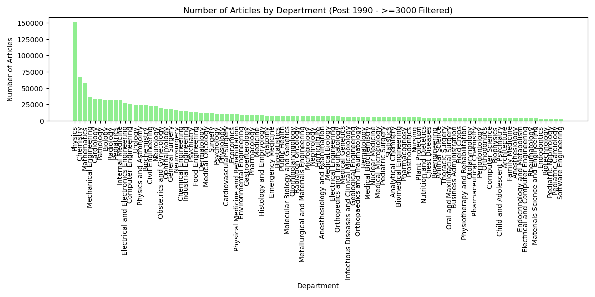

# Academic Publication Analysis — Scopus and University Data

**Graduate coursework at Özyeğin University — CS552.A, Data Science with Python.** Emre Öztürk and Ali Baki Türköz carried out all stages jointly and equally. This private portfolio explains an exploratory study of academic publication records and university information in Turkey.

## What problem was addressed?
Records from different sources use inconsistent name order, Turkish/English spelling and institution names. People with the same name can be confused. The study prepared and matched Scopus/university information, then explored how recorded publication counts vary by year, city, institution type and department.

## What was done and how?
Course materials describe data collection, text/name standardization, spelling cleanup, name-plus-institution matching and exploratory summaries using Scopus and YÖK Atlas information. The surviving outputs include aggregate charts. **Original Python scripts have now been recovered** from the VSCode archive: Selenium collection, name/character cleanup, author-affiliation processing, prototype matching and aggregation. Five selected code excerpts are included; full research data and complete scripts remain outside this portfolio. The earlier Word document contained placeholders, but it is no longer the only available code source. See [recovered-code scope](docs/RECOVERED_CODE.md).

## Archived outputs

*Source chart: 1970 onward. An upward pattern in recorded totals is visible; these are not independently verified unique nationwide paper counts.*

*Post-1990 source view, filtered to departments with at least 3,000 recorded articles. Similar counts do not prove collaboration.*

*State/private counts in the source's 2024 Group 1 subset; subset selection is not documented here.*

*City-level 2024 aggregate view. Collection coverage and counting units limit interpretation.*

[Output scope and limitations](results/README.md), [method and study context](docs/PROJECT_CONTEXT.md).

## Selected original code and small data illustration
- [Recovered original functions and matching excerpt](examples/README.md): text normalization, author/affiliation cleanup, name formatting, name-only join logic and historic pagination XPath.
- [Later aggregate-processing example](examples/aggregate_counts.py), explicitly separate from the recovered code.
- [Four fabricated institution/year rows](data/synthetic_institution_counts.csv), unrelated to the archived graph values.
- [Image and code source manifest](docs/SOURCE_MANIFEST.json).

No raw person-level matching workbook or demographic-label records are included. The project demonstrates data cleaning, text standardization, record matching, exploratory analysis and cautious interpretation of aggregation. It is a course study; publication/deployment is not established.

## Portfolio preparation and contact
Documentation and selected portfolio examples were prepared with **Codex and Claude assistance**, separately from the original course work. All materials remain **private**. Full material requests: **emre.ozturk.2098@gmail.com**.
