# Full archived publication-analysis gallery

30 distinct source PNGs are retained unchanged (duplicate identical files are not repeated). These plots describe archived source counts; no new research result was calculated. Historical inferred-gender figures are descriptive views of algorithmic labels, not verified demographic measurements.

## 2024_article_counts (1).png

## 2024_article_counts.png

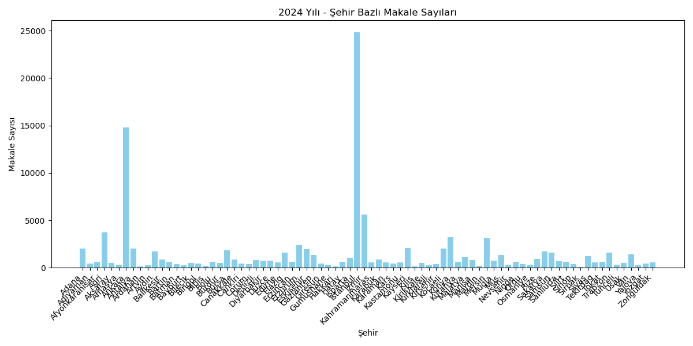

## 2024_type_article_counts(1).png

## 2024_type_article_counts.png

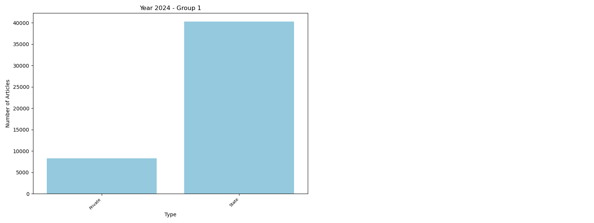

## 2024_university_article_counts (1).png

## 2024_university_article_counts.png

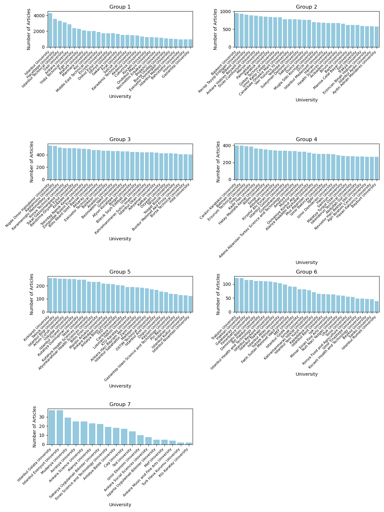

## city_gender_productivity_Istanbul(1).png

## city_gender_productivity_Istanbul.png

## Department_Article_Count_Post_1990_Filtered(1).png

## Department_Article_Count_Post_1990_Filtered.png

## Faculty_Article_Count_Post_1990_Filtered(1).png

## Faculty_Article_Count_Post_1990_Filtered.png

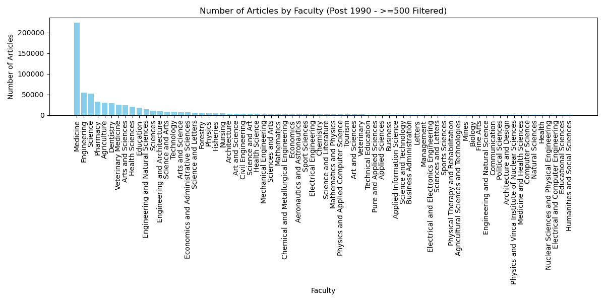

## gender_articles_2019_2024(1).png

## gender_articles_2019_2024.png

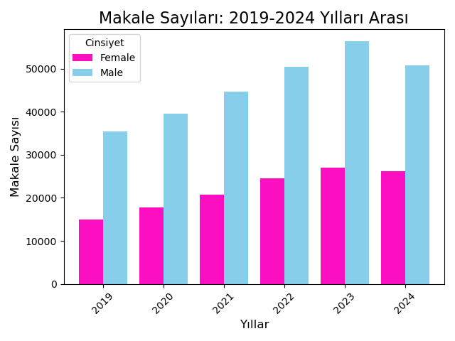

## gender_distribution_by_city (1).png

## gender_distribution_by_city.png

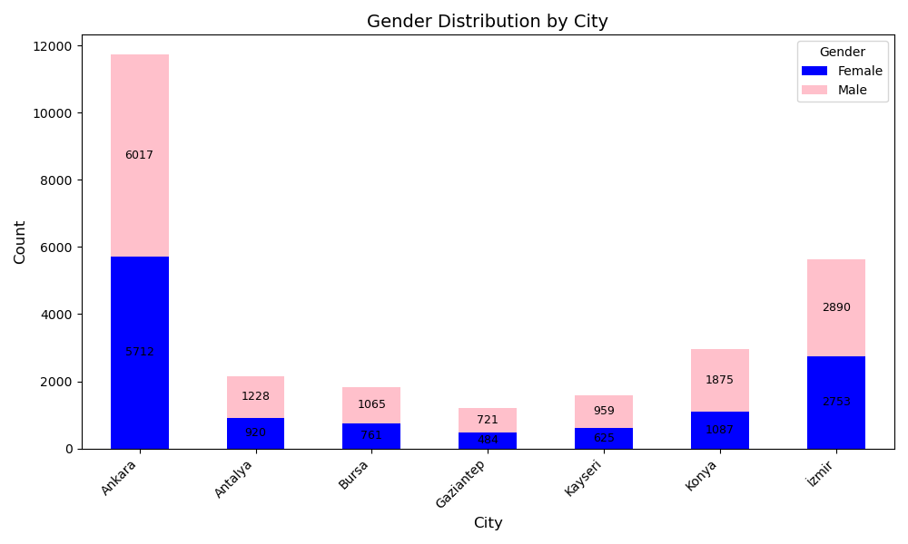

## gender_distribution_by_type (1).png

## gender_distribution_by_type.png

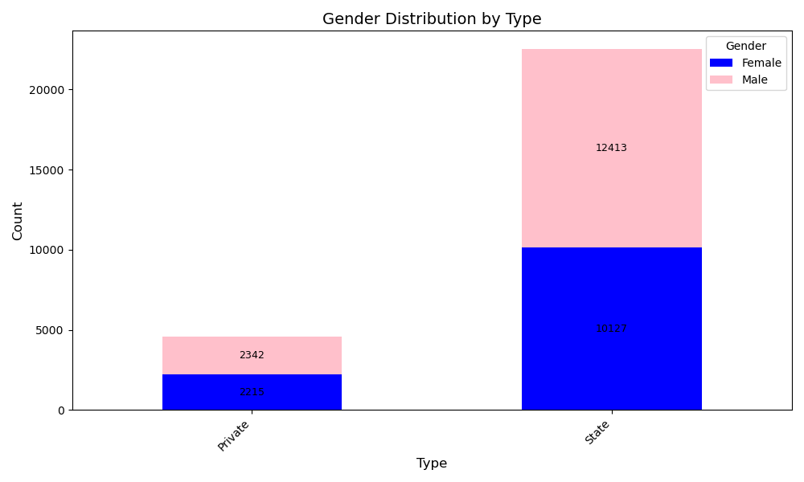

## Istanbul_Year_Article_Count(1).png

## Istanbul_Year_Article_Count.png

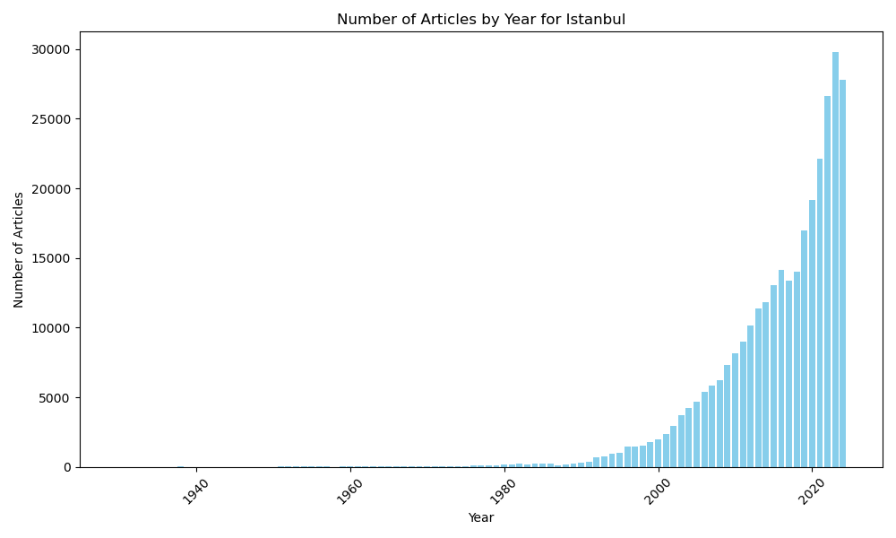

## number_by_title_and_city (1).png

## number_by_title_and_city.png

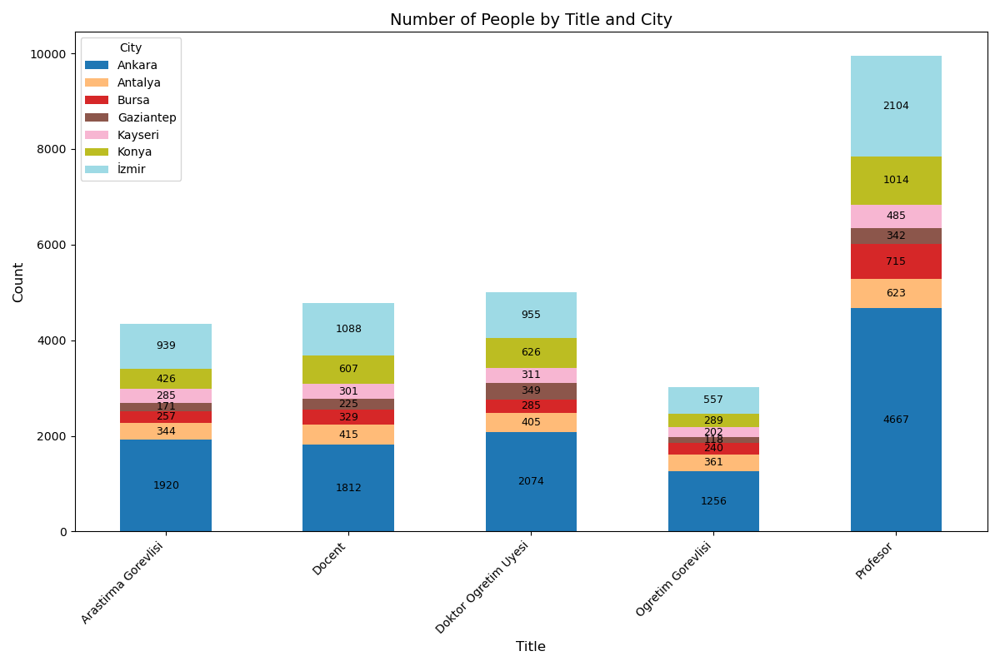

## Ozyegin University_articles_per_year(1).png

## Ozyegin University_articles_per_year.png

## type_gender_productivity_Private(1).png

## type_gender_productivity_Private.png

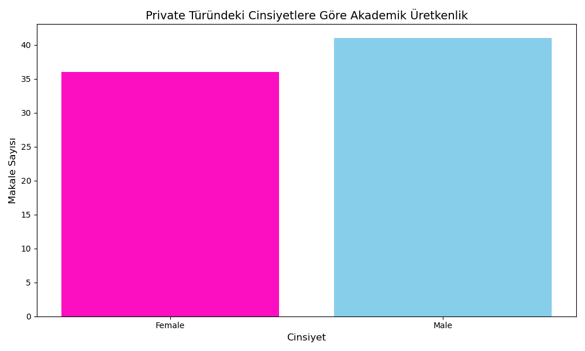

## type_gender_productivity_State(1).png

## type_gender_productivity_State.png

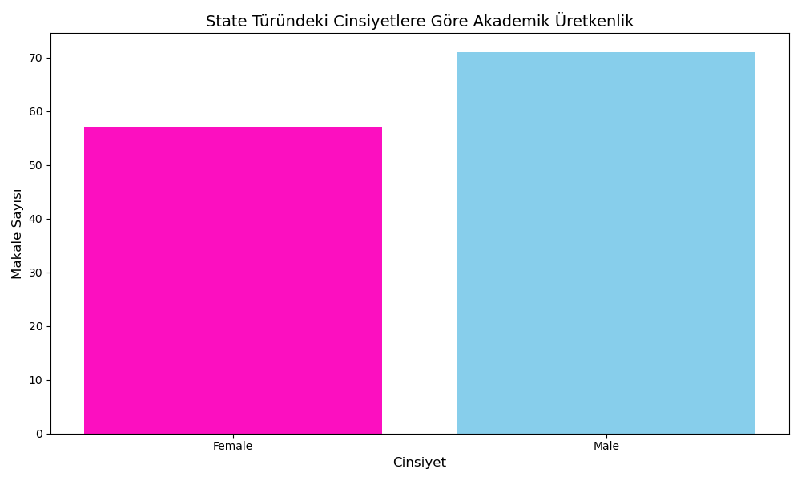

## Year-Number_of_Articles(1).png

## Year-Number_of_Articles.png

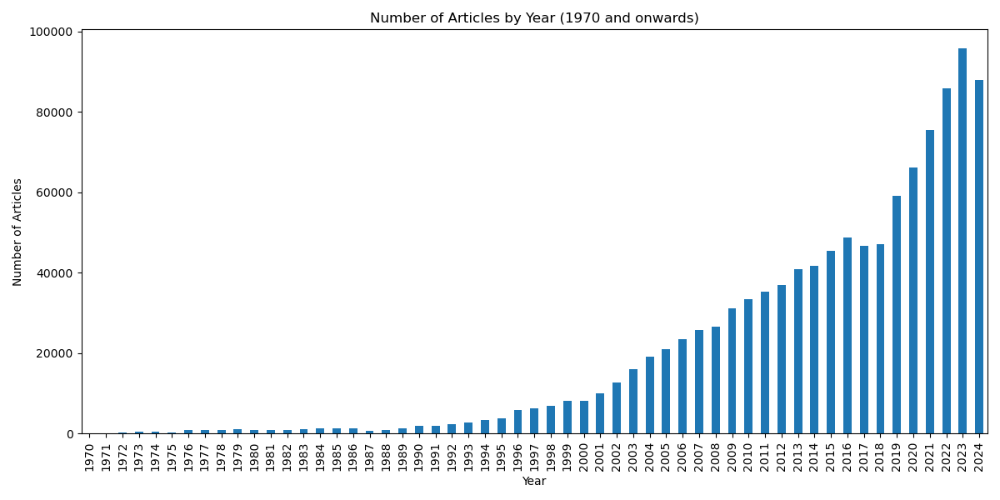
